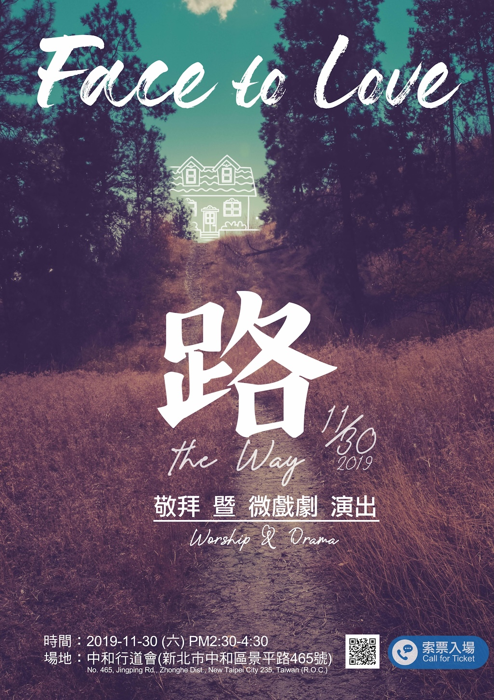

<!---
如欲新增新的活動訊息, 參照下列三個步驟:

1. 製作圖檔
  1.1 將海報圖檔改成這個尺寸: 1024 × 1449, 72dpi
  1.2 將圖檔上傳至 tinypng.com 縮小並下載
  1.3 將壓縮好的圖檔上傳至 /events. 名稱建議活動日期方便管理, 例如 2025-05-02.jpg

2. 以此格式新增條目在下:

- 

--->

- 
- 
- 
